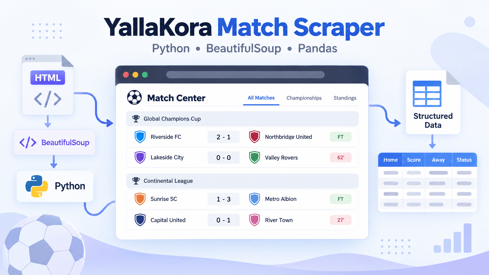

# Web Scraping with Python

A practical collection of Python web-scraping examples using **Requests**, **BeautifulSoup**, **Pandas**, **lxml**, and **OpenPyXL**. The project separates the original notebook code into three standalone scripts without changing the scraping logic.


## Project Overview

This project demonstrates how to request web pages, parse their HTML, extract selected information, print the results, and save football match data to an Excel file. The examples cover books, inspirational quotes, and football match results.

The three scripts preserve the original notebook workflow and field names. They are intentionally simple so the scraping steps remain clear for beginners.

## Technologies Used

- **Python** for scripting.
- **Requests** for downloading web pages.
- **BeautifulSoup** for parsing HTML.
- **Pandas** for creating a DataFrame from match results.
- **lxml** as the parser used for the YallaKora page.
- **OpenPyXL** through Pandas for Excel export.

## Project Structure

```text
web-scraping-python/
│
├── books_scraper.py
├── quotes_scraper.py
├── yallakora_scraper.py
│
├── images/
│   ├── books-scraper.png
│   ├── quotes-scraper.png
│   └── yallakora-scraper.png
│
├── requirements.txt
└── README.md
```

The YallaKora script creates `matches1.xlsx` in the project directory after it runs.

## 1. Books to Scrape


The `books_scraper.py` script requests the first page of [Books to Scrape](https://books.toscrape.com/). It finds each `product_pod` article and prints the book name, price, and availability.

Run it with:

```bash
python books_scraper.py
```

## 2. Quotes to Scrape


The `quotes_scraper.py` script requests the first page of [Quotes to Scrape](https://quotes.toscrape.com/). It collects the quote text, author, and tags into a list of dictionaries, then prints that list.

Run it with:

```bash
python quotes_scraper.py
```

## 3. YallaKora Match Scraper



The `yallakora_scraper.py` script asks the user for a match date and requests the corresponding [YallaKora match-center](https://www.yallakora.com/match-center) page. It extracts championship names, finished matches, team names, match results, scores, and match times. The results are converted into a Pandas DataFrame, printed, and saved as `matches1.xlsx`.

Run it with:

```bash
python yallakora_scraper.py
```

When prompted, enter the date in the format expected by the original script, such as:

```text
01/15/2026
```

## How to Run

1. Clone the repository:

   ```bash
   git clone https://github.com/youmna24zaian/web-scraping-python.git
   cd web-scraping-python
   ```

2. Install the required packages:

   ```bash
   python -m pip install -r requirements.txt
   ```

3. Run any of the three scripts:

   ```bash
   python books_scraper.py
   python quotes_scraper.py
   python yallakora_scraper.py
   ```

On some systems, use `python3` and `pip3` instead of `python` and `pip`.

## Learning Objectives

This project helps learners practice sending HTTP requests, parsing HTML with BeautifulSoup, selecting page elements, extracting text and attributes, storing records in Python lists and dictionaries, creating a Pandas DataFrame, and exporting tabular data to Excel.

## Disclaimer

This repository is intended for educational purposes. Before scraping any website, review its terms of service, robots.txt guidance, rate limits, and applicable laws. Use responsible request rates, collect only information that you are permitted to access, and do not use these scripts to bypass authentication, access controls, or other technical restrictions. Website layouts and URLs can change, so a scraper may require maintenance over time.

## Author

**Youmna Zaian** · [GitHub](https://github.com/youmna24zaian)

## References

[1]: https://books.toscrape.com/ "Books to Scrape practice website"
[2]: https://quotes.toscrape.com/ "Quotes to Scrape practice website"
[3]: https://www.yallakora.com/match-center "YallaKora match center"
